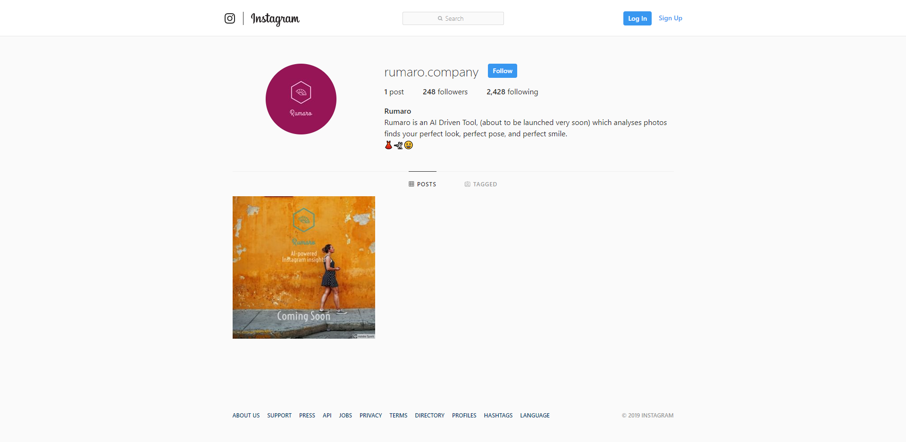
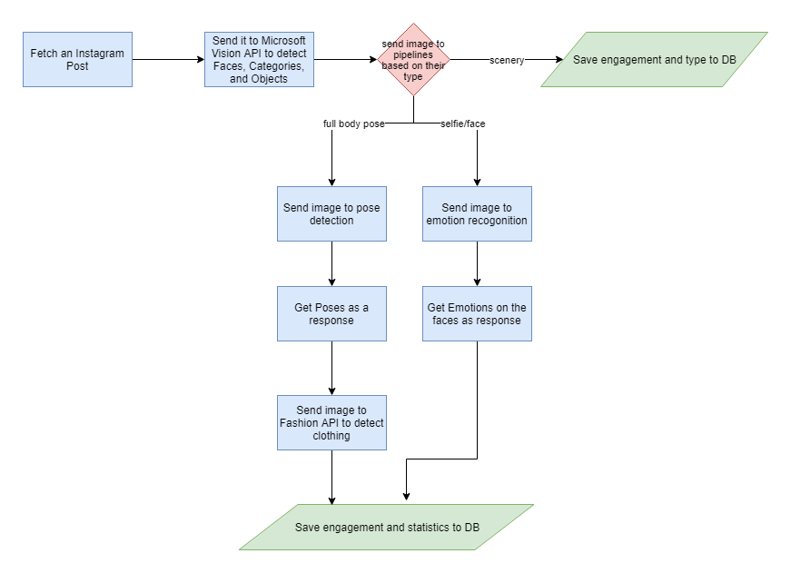
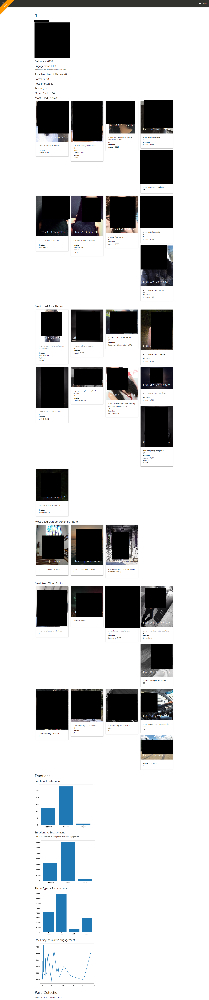
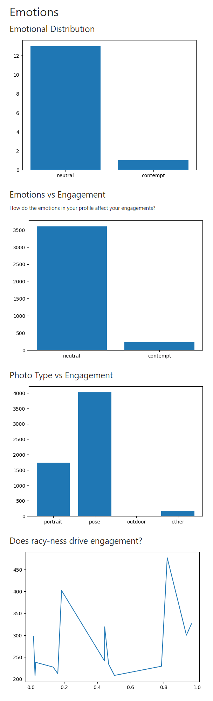

# Rumaro - AI to recognize emotions, apparel, body pose and activity in images 

Rumaro uses AI to recognize emotions, apparel, body pose and activity in images, 
and measures how they affect audience engagement. ie. likes and comments.

>This started out as one of my weekend side hustles and was initially meant to be launched as a paid SAAS. But, on 
researching more about the privacy concerns, Instagrams restrictive APIs and mixed results from the initial tests I 
decided to scrape the idea and just Open Source it instead.

## Setup
0. Setup MS Cognitive Services API Keys, DeepFashion, and Instagram Credentials
1. Install the dependencies 
`pip install -r requirements.txt`
2. Run the actual analysis `python run_rumaro.py --instagram_id <INSTA_ID>`

Here comes the tricky part, now grab your pair of debugging goggles and start digging around the various property of 
the `data_groomer` object for something useful. I am just waaay to burnt out to add graphs and UI 
to this now.  

### The why?

> With Rumaro, I tried to identify *what* really made photos special! 🦄

I hypothesised that - Photos which the user liked, i.e photos which were more desirable could be identified using AI 
models and the key _features_ which made them special could be thus identified. 

I thought the Racy-ness, Body Pose and 
Apparel could be easily identified using Deep Learning and these would be the *only* features which would be driving the
social media engagement. 

### The how?
##### Outline 

All the instagram posts of a user to be analyzed would be downloaded, then these would be sent to several deep learning models
to generate insights from them, to know what makes them special.

##### Steps

1. An Instagram post is fetched and the public url of the image is stored
2. It is sent to Microsoft Vision API to be categorized into a scenery/other image, full body/ pose image or a portrait or selfie.
3. If the image is a scenery it is not sent to any further analysis
4. Body Pose images are sent to a Pose Detection Model running on OpenCV and then to DeepFashion API from Algorithmia for apparel detection. 
5. The Portraits or Selfie posts are sent to Microsoft's Emotion API.
6. All of the insights are then stored into the DB and the user is redirect to the payment page
7. Show the user the curated analysis of his profile.

> Yes! I even started a Instagram Page and tried to find a target audience - influencers, who were actually willing 
>to pay to use the product

### Vision

The vision was to create a massive SAAS Company who charged people ~10$ for reviewing a profile. 
I imagined it would have been possible to create a sustainable business out of this. 

I had a vision that the insights generated would be so useful that it would allow users to boost their social media profiles
significantly, and I imagined that the Deep Learning Models would be super-accurate and would predict everything as 
real humans perceive it.  

#### How far ahead did I actually get?

* I successfully managed to create an okay looking Frontend using MaterializeCSS, with Flask on the Backend.
* I managed to create the core AI components of the project - talking to all the APIs, the Deep Learning part
* I managed to create add authentication and databases to it.
  
I decided that it only made sense to publish the stripped down version of the entire codebase, without the Web Framework
code and Flask packages. 

##### Screenshots

> The generated Report after analysing a random instagram account. 
> Yes, I had to censor all of the images, yeah, that kinda' defeats the whole purpose of the screenshots 🤷🏽‍♂️

> Statistics generated after analysing a random instagram profile

### ⚓ Jumping off the sinking ship...  

Unfortunately as I moved forward with the project I discovered that the coorelation between the different features
and the engagement was very weak. Also, this project had nightmarish privacy concerns which made it extremely difficult
to monetise and market. 

In retrospect it seems really obvious that the plan was a bit flawed from the square one. 
🤷🏽‍♂️

Ehh... I did get to play around with a lot of Deep Learning APIs, so all was good.

### Reach out to me!

If you are interested to build something similar yourself, or would like help getting this up and running or if you are 
_planning to turn this into a movie!!!_ Hit me up on Google Hangouts at `rohansawantct83@gmail.com`   